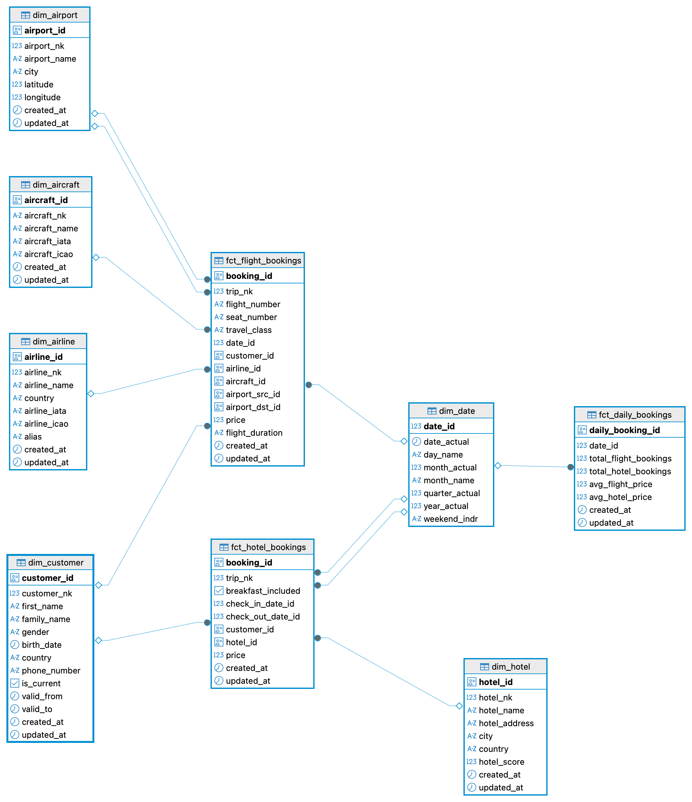

# PacTravel Data Warehouse - Project Report

## Project Overview

This project implements a complete **ELT (Extract, Load, Transform) data pipeline** for PacTravel, a travel-domain transactional system. The pipeline extracts data from an operational PostgreSQL database, loads it into a staging area, and transforms it into a **star-schema data warehouse** optimized for analytical queries.

### Tech Stack

| Component | Technology |
|-----------|-----------|
| Extract & Load | Python 3.11, psycopg2 |
| Orchestration | Luigi |
| Transform | dbt (dbt-postgres) |
| Database | PostgreSQL 16 (Docker) |
| Scheduling | Cron + shell script |
| Alerting | Luigi event handlers |

### Architecture

```
Source DB (port 5433)           DWH DB (port 5434)
┌──────────────────┐    EL     ┌───────────────────┐   dbt    ┌──────────────────┐
│  public schema   │ ───────>  │ pactravel schema  │ ──────>  │  final schema    │
│  (7 tables)      │  Luigi    │ (staging mirror)  │          │ (star schema)    │
└──────────────────┘           └───────────────────┘          └──────────────────┘
```

---

## Step 1 - Requirements Gathering

> Full report: [docs/step_1_requirements_gathering.md](docs/step_1_requirements_gathering.md)

### Data Source

PacTravel's source database contains **7 tables** with flight and hotel booking data:

| Table | Rows | Description |
|-------|------|-------------|
| `aircrafts` | 246 | Aircraft master data |
| `airlines` | 1,251 | Airline master data |
| `airports` | 105 | Airport master data |
| `customers` | 1,000 | Customer profiles |
| `hotel` | 1,470 | Hotel master data |
| `flight_bookings` | 8,190 | Flight booking transactions |
| `hotel_bookings` | 217 | Hotel booking transactions |

### Business Requirements

1. **Track Daily Booking Volumes** - Monitor how many bookings are made for flights and hotels each day
2. **Monitor Average Ticket Prices Over Time** - Analyze how ticket prices fluctuate over time

### Problem Statement

The OLTP database is not optimized for analytics - no aggregated metrics, no dimensional structure, and running analytical queries directly on production risks performance degradation.

---

## Step 2 - Data Warehouse Design

> Full report: [docs/step_2_dwh_design.md](docs/step_2_dwh_design.md)

### Star Schema

The DWH follows a **star schema** pattern with 6 dimensions and 3 fact tables.

### ERD



### Dimensions

| Dimension | SCD Type | Description |
|-----------|----------|-------------|
| `dim_date` | N/A | Pre-generated date spine (3,317 rows) |
| `dim_customer` | Type 2 | Customer profiles with historical tracking |
| `dim_airline` | Type 1 | Airline reference data |
| `dim_aircraft` | Type 1 | Aircraft reference data |
| `dim_airport` | Type 1 | Airport reference data (role-playing: source & destination) |
| `dim_hotel` | Type 1 | Hotel reference data |

### Fact Tables

| Fact Table | Type | Grain |
|-----------|------|-------|
| `fct_flight_bookings` | Transaction | One row per seat per flight booking |
| `fct_hotel_bookings` | Transaction | One row per hotel booking |
| `fct_daily_bookings` | Periodic Snapshot | One row per day per booking type |

---

## Step 3 - Pipeline Implementation

> Full report: [docs/step_3_pipeline_implementation.md](docs/step_3_pipeline_implementation.md)

### Pipeline DAG

```
ExtractLoadAircrafts  ──┐
ExtractLoadAirlines   ──┤
ExtractLoadAirports   ──┤
ExtractLoadCustomers  ──┼──> AllExtractLoad ──> DbtSnapshot ──> DbtRun ──> MasterPipeline
ExtractLoadHotel      ──┤
ExtractLoadFlightBookings ──┤
ExtractLoadHotelBookings ──┘
```

### Project Structure

```
pactravel-pipeline/
├── .env.example                  # Credential template
├── requirements.txt
├── luigi.cfg
├── run_pipeline.sh               # Cron-ready pipeline runner
├── docs/                         # Project documentation
│   ├── erd_dwh.png
│   ├── step_1_requirements_gathering.md
│   ├── step_2_dwh_design.md
│   ├── step_3_pipeline_implementation.md
│   └── step_4_pipeline_results.md
├── src/
│   ├── __init__.py
│   ├── extract_load/
│   │   ├── __init__.py
│   │   ├── db_connections.py     # DB connection helpers
│   │   └── tasks.py              # Luigi EL tasks (7 tables)
│   ├── pipeline.py               # Master Luigi pipeline
│   └── alert.py                  # Failure alerting handler
└── dbt_pactravel/
    ├── dbt_project.yml
    ├── profiles.yml
    ├── snapshots/
    │   └── snap_dim_customer.sql  # SCD Type 2
    └── models/
        ├── staging/               # Source references (views)
        ├── dimensions/            # Dimension tables
        └── facts/                 # Fact tables
```

### Key Implementation Details

- **Extract & Load**: 7 Luigi tasks using `psycopg2`, truncate-and-load pattern with auto table creation
- **Transform**: dbt project with staging views, dimension tables (SCD Type 1 & 2), and fact tables
- **SCD Type 2**: `dim_customer` implemented via dbt snapshot with `check` strategy on all columns
- **Scheduling**: `run_pipeline.sh` for cron-based daily execution
- **Alerting**: Luigi `@event_handler(FAILURE)` writes to `logs/alerts.log`

---

## Step 4 - Pipeline Results

> Full report: [docs/step_4_pipeline_results.md](docs/step_4_pipeline_results.md)

### Pipeline Execution

All 11 Luigi tasks completed successfully:

```
===== Luigi Execution Summary =====
Scheduled 11 tasks of which:
* 11 ran successfully
This progress looks :) because there were no failed tasks or missing dependencies
===== Luigi Execution Summary =====
```

### DWH Table Row Counts

| Table | Row Count |
|-------|-----------|
| dim_date | 3,317 |
| dim_customer | 1,000 |
| dim_airline | 1,251 |
| dim_aircraft | 246 |
| dim_airport | 105 |
| dim_hotel | 1,470 |
| fct_flight_bookings | 8,190 |
| fct_hotel_bookings | 217 |
| fct_daily_bookings | 2,548 |

### Business Requirement Results

**1. Daily Booking Volumes** (`fct_daily_bookings`):

| Date | Type | Bookings | Revenue | Avg Price |
|------|------|----------|---------|-----------|
| 2010-01-02 | flight | 1 | 131 | 131.00 |
| 2010-01-26 | flight | 3 | 1,069 | 356.33 |
| 2010-02-20 | hotel | 1 | 3,120 | 3,120.00 |

**2. Monthly Average Ticket Prices** (flight bookings by month):

| Year | Month | Avg Price | Bookings |
|------|-------|-----------|----------|
| 2010 | January | 286.85 | 13 |
| 2010 | May | 526.56 | 18 |
| 2010 | December | 377.80 | 20 |

### Key Insights

1. **Most Popular Airline**: Ryanair leads with 500 bookings
2. **Top Revenue Hotel**: InterContinental London Park Lane at $6,480 total revenue
3. **Travel Class Split**: Business class (4,126 bookings, avg $577.51) vs Economy (4,064 bookings, avg $171.39)
4. **Busiest Route**: Mirnyj to Moscow with 8 flights
5. **Price Variation**: Monthly average ticket prices range from ~$260 to ~$530, showing seasonal fluctuation

---

## How to Run

```bash
# 1. Start databases
cd pactravel-dataset && docker compose up -d

# 2. Install dependencies
pip install -r requirements.txt

# 3. Configure credentials
cp .env.example .env

# 4. Run the pipeline
rm -f temp/*.done
python -m luigi --module src.pipeline MasterPipeline --local-scheduler
```

### Scheduling (Cron)

```bash
0 0 * * * /path/to/pactravel-pipeline/run_pipeline.sh
```
